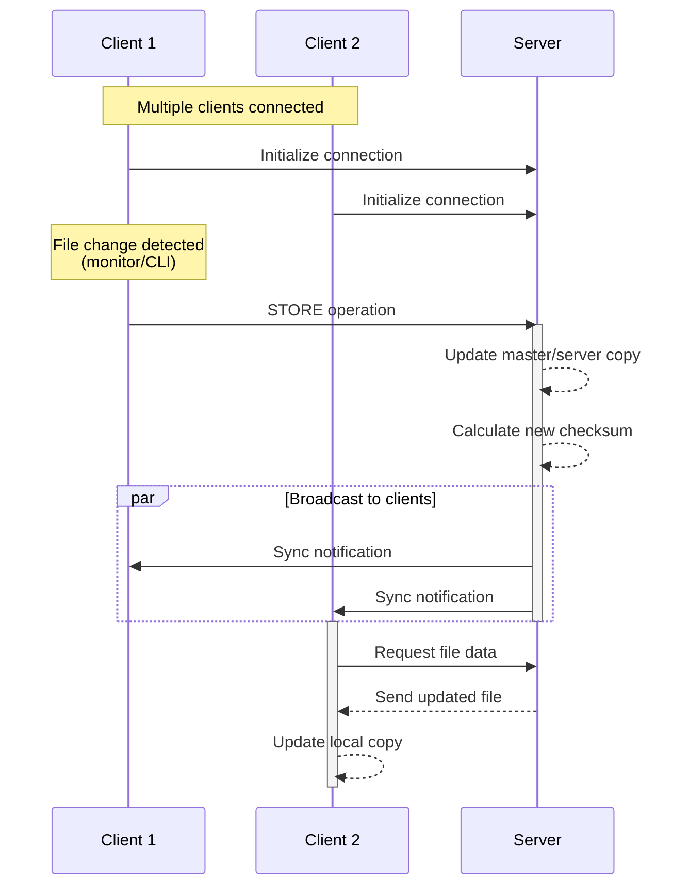
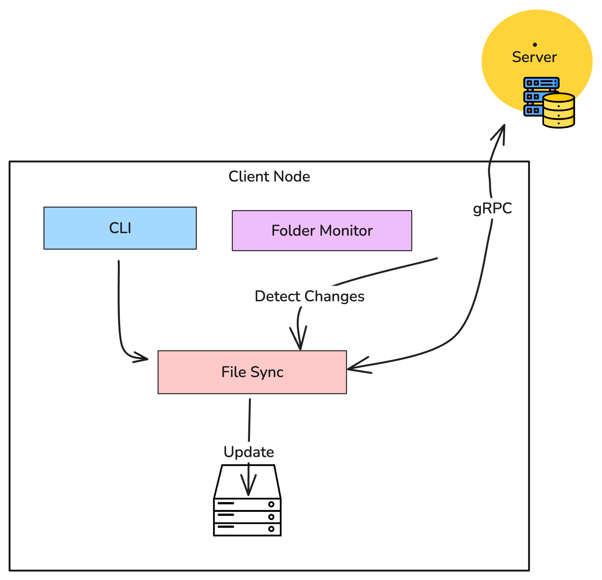
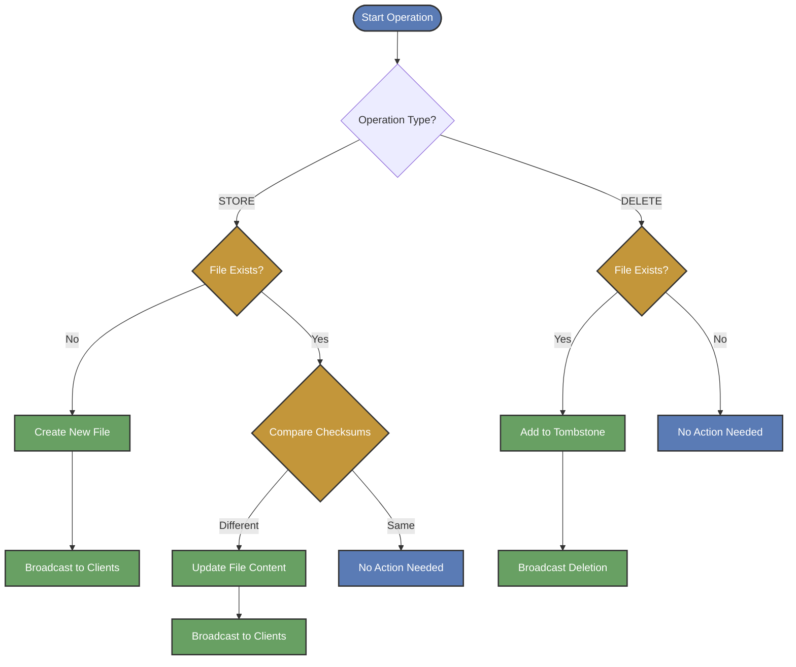

# The Andrew File System
The Andrew File System: https://pages.cs.wisc.edu/~remzi/OSTEP/dist-afs.pdf

# Andrew File System Overview

The Andrew File System implements a straightforward client-server architecture for distributed file management. The system consists of a central server and multiple client nodes.

### Architecture
The distributed file synchronization system consists of two main components: **a server** and **multiple clients**. The server acts as a centralized hub, managing file storage and synchronization while maintaining authoritative copies of all files. It handles incoming client requests for file operations and implements a callback mechanism to ensure proper synchronization across the system.



### Client Components
On the client side, multiple nodes can access and modify files through both automatic and manual means. Each client implements folder monitoring for automatic change detection and provides a CLI interface for manual file operations. Clients are responsible for maintaining their local file state and ensuring proper synchronization with the server.



### Core Operations
The system supports two key file management operations: `FETCH`, `STORE` and `DELETE`. The `STORE` operation handles both creating new files and updating existing ones, while `DELETE` removes files from the system. These operations can be triggered either through the automatic folder monitoring system or via manual CLI commands.



### Synchronization Architecture
The synchronization mechanism employs a "train station" model for callbacks using gRPC. Clients initiate continuous synchronization requests to the server, and the system uses file checksums and modification timestamps to track changes. Clients maintain active connections to receive updates whenever changes occur in the system.


## Get Started

Setup
```sh
make setup
```

Start Server
```sh
./bin/afs-server --mount=./tmp/server
```

Client 1
```sh
./bin/afs-client --id client1 --mount ./tmp/client1 watch
```

Client 2
```sh
./bin/afs-client --id client2 --mount ./tmp/client2 watch
```

Client 3
```sh
./bin/afs-client --id client3 --mount ./tmp/client3 watch
```

### AFS Server Command

```
Usage:
  ./afs-server [flags]

Flags:
  -h, --help           help for afs-server
      --mount string   Storage directory for files (default "./mount/server")
      --port int       The server port (default 50051)
```


### AFS Client Command

```
Usage:
  ./afs-client [command]

Available Commands:
  delete      Delete a file from the system
  fetch       Fetch a file from the system
  help        Help about any command
  store       Store a file in the system
  watch       Watch the mount directory for changes and sync with AFS

Flags:
  -h, --help            help for afs-client
      --id string       client identifier
      --mount string    Storage directory for client cache (default "./tmp/client")
      --server string   server address (default "localhost:50051")
```