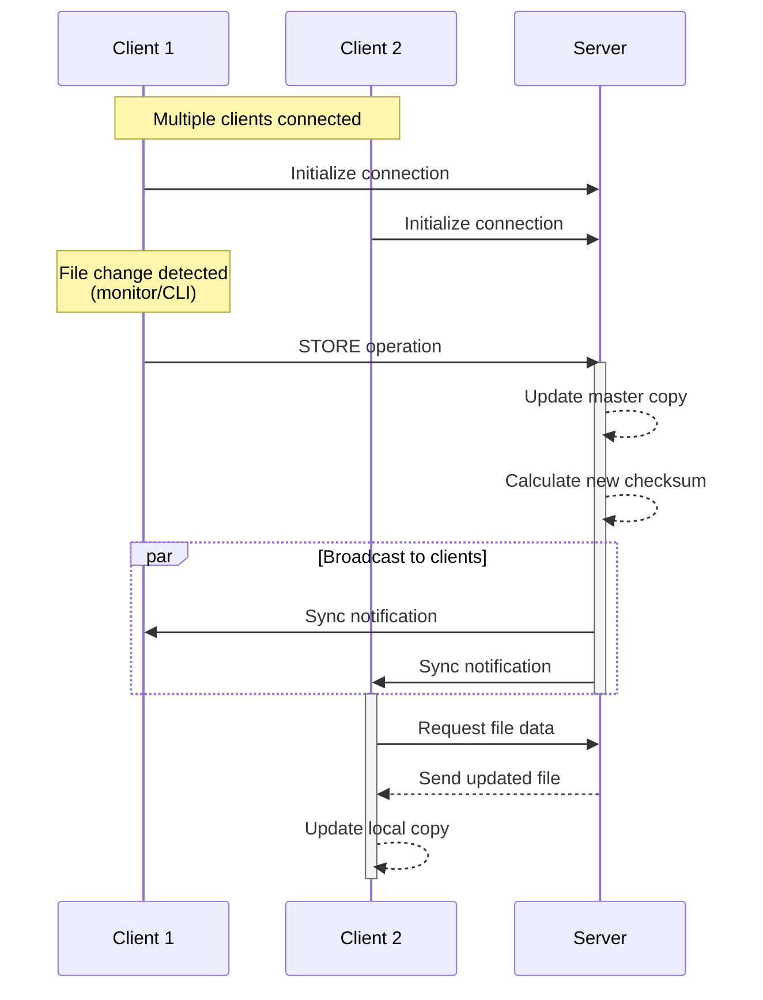

# The Andrew File System
The Andrew File System: https://pages.cs.wisc.edu/~remzi/OSTEP/dist-afs.pdf

# Andrew File System Overview

The Andrew File System implements a straightforward client-server architecture for distributed file management. The system consists of a central server and multiple client nodes.


## Architecture


## Core Components

### Server
- Single centralized server that manages file storage and synchronization
- Maintains authoritative copies of all files
- Handles client requests for file operations
- Implements callback mechanism for client synchronization

### Clients
- Multiple client nodes that can access and modify files
- Implements folder monitoring for automatic change detection
- Provides CLI interface for manual file operations
- Maintains local file state and synchronizes with server

## Key Operations

### File Management
- `STORE`: Creates new files or updates existing ones
- `DELETE`: Removes files from the system
- Changes can be triggered either through:
  - Automatic folder monitoring system
  - Manual CLI commands

### Synchronization Mechanism
- Implements a "train station" model for callbacks using gRPC
- Clients initiate continuous synchronization requests to the server
- Server-client synchronization uses file checksums and modification timestamps
- Clients maintain active connections to receive updates when changes occur

## Synchronization Process
1. Client detects changes through folder monitoring or CLI commands
2. Client initiates communication with server
3. Server compares checksums and modification times
4. Server broadcasts changes to connected clients through callback mechanism
5. Clients update their local files to match server state

## Get Started

Setup
```sh
make setup
```

Start Server
```sh
./bin/afs-server --mount=./tmp/server
```

Client 1
```sh
./bin/afs-client --id client1 --mount ./tmp/client1 watch
```

Client 2
```sh
./bin/afs-client --id client2 --mount ./tmp/client2 watch
```

Client 3
```sh
./bin/afs-client --id client3 --mount ./tmp/client3 watch
```
